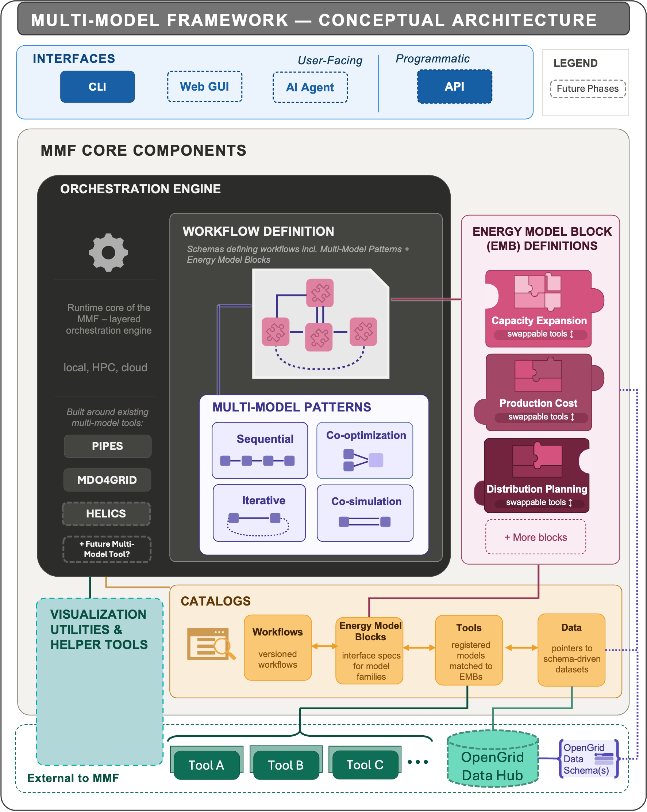

# MMF
The Multi Model Framework (MMF) allows easy integration, exploration, and swappability of energy model tools within multi-step planning and analysis workflows

## Overview
The Multi-Model Framework (MMF) is a new open-source software framework being developed by the National Laboratory of the Rockies (NLR) to orchestrate multi-model energy planning workflows. Rather than a standalone modeling tool, the MMF is best understood as the connective tissue that sits between existing simulation, optimization, and analysis tools—enabling analysts and model integrators to assemble end-to-end workflows with plug-and-play models, standardized data exchange, consistent data interpretation, and shared interfaces across tools. The MMF is designed to serve power grid and multi-energy sector planning at scales ranging from local distribution systems to continental transmission networks

Today, multi-model energy analyses are routinely assembled through ad hoc scripting combined with extensive use of institutional knowledge for manually converting/harmonizing data, aligning definitions, and establishing consistent assumptions. The result is integration work that is brittle, non-reproducible, siloed within individual organizations, and rebuilt largely from scratch for each new project. Stakeholder engagement with the MMF project’s Technical User Groups (TUGs) confirmed that analysts across regions and roles spend substantial fractions of project timelines on data formatting and tool hand-offs rather than analysis itself. The MMF is being designed to address this gap by providing modular multi-model orchestration in partnership with wider efforts around interoperability.

### Energy Model Blocks
Standard tool model blocks will be developed to allow energy models to be swapped within workflows, referred to as Energy Model Blocks (EMBs). EMBs are abstract interface specifications for families of models that answer the same analytical question (e.g., bulk capacity expansion, production cost, distribution simulation, resource adequacy). An EMB defines the analytic goal, inputs, outputs, minimum required subfunctions, and scope a conforming tool must implement; any tool that satisfies the specification can be registered and swapped into a workflow as a configuration change rather than a re-engineering exercise. These blocks and associated helper functions will be defined and developed in alignment with standardized energy data schemas being developed by other Open Energy Initiative partners.

### Workflow Definitions
The MMF includes tool interface handling so that users can easily arrange tools into workflow processes; referred to as workflow definitions. Workflow definitions are configurable, versioned schemas for multi-model interconnection as a composition of four fundamental coupling patterns: Sequential, Iterative, Co-simulation, and Co-optimization. These patterns are composable within a single workflow (for example, an iterative convergence loop wrapped around a co-simulation core), allowing complex analyses to be expressed declaratively and re-used. Such workflows define not only the sequence of models, but also the data exchange and supporting helper functions for transformations such as aggregation and disaggregation.

### Orchestration Engine
The Orchestration Engine will be the runtime core of the MMF. It will read a workflow definition developed or selected by the analyst, query catalogs to validate that the tool selections conform to the required Energy Model Block definitions, assemble an execution plan, and manage the full lifecycle of the workflow run. This lifecycle will include sequencing model executions, managing data hand-offs at block boundaries, enforcing convergence logic for iterative patterns, synchronizing time stepping for co-simulation patterns, coordinating the overarching solver configuration for co-optimization patterns, and dispatching work to the appropriate compute environment. The engine will be responsible for translating the various parts of the problem definition into a running multi-model analysis.

A key design decision is that the Orchestration Engine will provide a high-level shared interface into different orchestration backends. To do so, the engine will present a uniform workflow definition and execution environment to analysts (and AI agents) and then in most cases decide based on the problem structure which backends to use for execution. This design will allow the MMF to support both manual analyst-driven workflows, where a human configures, launches, and monitors execution through the CLI or GUI, and semi and fully automated workflows, where a technical modeler, AI agent, external system composes and invokes a workflow programmatically through an API. The same engine and other MMF elements will serve both modes.

The intent of the Orchestration Engine is to leverage existing backends for implementing the multi-model patterns.  Three existing NLR frameworks that cover all four multi-model patterns will serve as the initial orchestration backends. The initial frameworks for the Engine are:
  - PIPES is a project and workflow management platform tailored toward sequential workflows and workflow lifecycle management,
  - MDO4Grid is a multi-disciplinary optimization framework that enables automated iteration and co-optimization, and
  - HELICS is a highly scalable co-simulation framework built in collaboration with LLNL and PNNL that enables message passing and co-iteration at each simulation timestep.

The orchestration engine will also capture execution metadata, logs, intermediate artefacts, data transformation records, model versions, and provenance. These pieces are important for validation of results and maintaining repeatability and explainability. Many of the tools will have their own data transformation records and logging, so the execution engine will mainly focus on capturing the pieces involved in handoffs and workflow execution to avoid duplication.

### Further Development
In addition to the previously discussed core capabilities. The MMF will also include:
  - Visualization interfaces for both creating workflows and analyzing results
  - Programmatic interfaces for interaction with databases and AI agents
  - Scalable computational configurations which can be executed across cloud platforms
  - Security and authentication mechanisms to assure access control to data and workflows
  - Example demonstration datasets and associated workflows

# How to Engage With the MMF
Users and potential users are encouraged to review the MMF product plan, available:
Feedback is also welcome via this repository.
A selection of potential users representing a wide range of applications and global interests is engaged in technical user group feedback workshops which also helps guide MMF development and demonstration material.

Updates to this repository will be made when source code is ready for stakeholder review and engagement in the coming months. Notice will be provided to all engaged users and potential users when the MMF is opensourced and demonstration examples are available.
